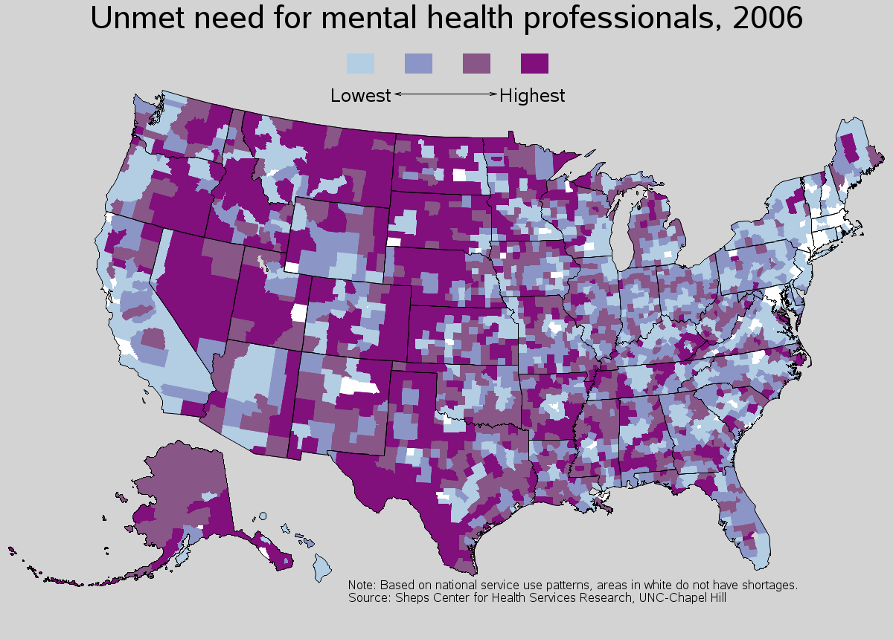
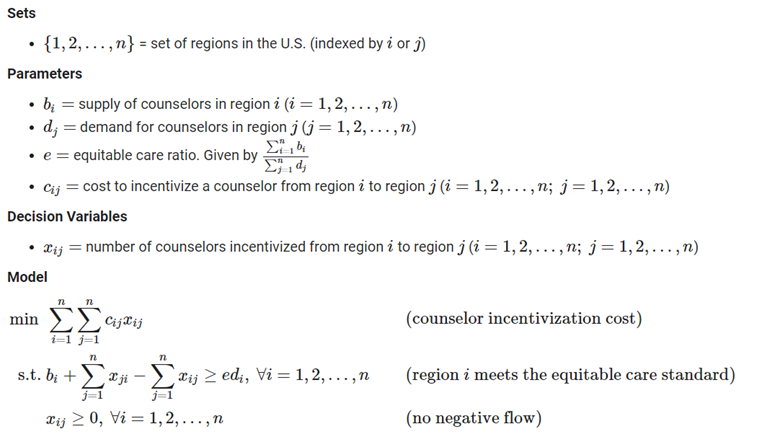
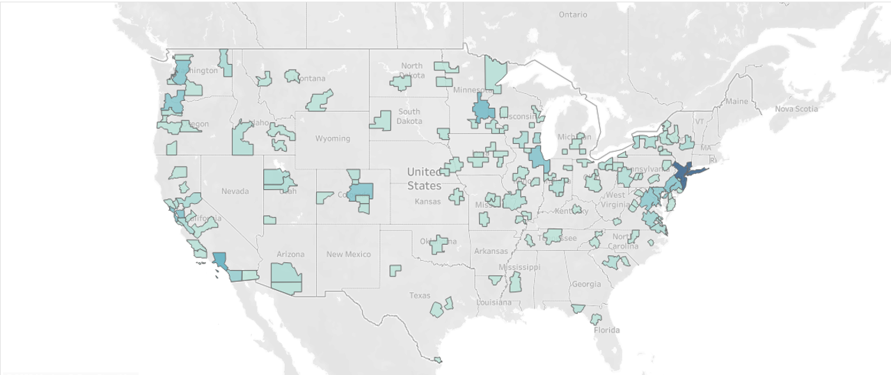
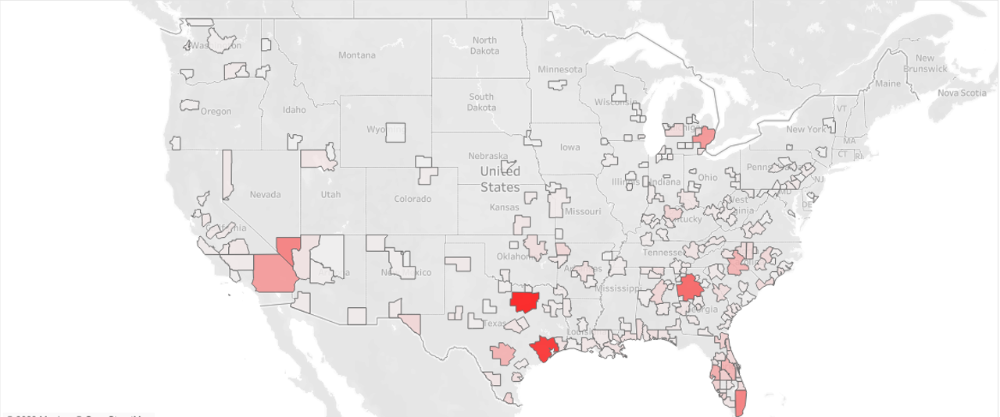

# Optimizing Incentives for Equitable Mental Healthcare

## Problem

     
    <em>Map of unment mental health need in united states by county. [1]</em>

Mental health resources are not equitably distributed in the United States. Many Americans live in areas with acute shortages of mental health professionals. Though the larger issue is with the supply of mental health workers, I became interested in a different question: 
**how much need can we meet by redistributing existing resources?**

I chose to examine this question in terms of **supply and demand**. How much need is there for mental health resources in a particular area, and what resources do they have? To approximate the demand for resources, I used indicators of mental distress. It is a well-studied phenomenon that correlates strongly with negative physical and mental outcomes and has readily available data. For supply, I chose to focus on the number of full-time mental health professionals in an area. Though there are many other resources that contribute to the mental health of a community, having professional treatment available is one of the most impactful.

To frame this problem, I drew from my experience with efforts to reduce educational inequality. In particular, there are efforts to fiscally  incentivize teachers to work in low-resource areas. I wanted to analyze how those same systems might work to **incentivize mental health counselors to move to areas with high mental distress**. 

I was particularly interested in two questions:

1. How much would it cost to redistribute resources based on need?

2. How can we maximize the impact of an investment in reallocation? 

## Model
Both of these questions center around the total cost of incentivizing counselor reallocation, so I designed a minimum-cost linear program to try and find the optimal incentivization strategy. This model could be useful for exploring "what-if" scenarios for a larger operation and deciding how to allocate human resources and advertising. 

     
    <em>Definition of my minimum-cost linear program for incentivizing  mental health counselors to move to underserved areas.</em>

My model (shown in the figure above) is trying to decide how we can incentivize mental health counselors to move between different regions in the United States to create a more equitable mental healthcare system. The decision variables $x_{ij}$ indicate the number of counselors that we want to move between two different regions. We want to minimize the cost of these incentives, so our objective is to minimize the total per counselor incentive cost multiplied by the total number of counselors that we want to move. 

Our primary constraint is that the equitable care standard be met. This standard is calculated by calculating the total ratio of supply and demand for mental healthcare professionals across the U.S. and multiplying it by the total demand in each region $d_i$. This calculation gives an estimate of the number of counselors that should be in a region if they were equitably distributed. 

On the other side of that constraint is a calculation for the total number of counselors in a region after the incentivization has worked. It is calculated by taking the initial supply $b_i$, adding the total flow in, and subtracting the total flow out. To meet this constraint, the model ensures that the total number of counselors in a region after our process is at least as large as the equitable care standard. 
Finally, we have a constraint to ensure that there is no negative incentivization. 

I chose not to add an integer constraint to the optimization model for two reasons. 
1. It would drastically increase our computation time and make our model cumbersome to work with.
2. I did not believe it was necessary to have that level of precision with our allocation because our model is based on incentives, which are an imprecise tool.

## Data

To populate the model, I chose to use a combination of public health studies, occupational data, and some assumptions about the incentivization program based on results from the education domain. 

### Health Data
To measure our demand (i.e., mental distress), I used the Places 2022: Local Data for Better Health dataset [2]. This dataset is part of a large-scale study that seeks to provide estimates of health conditions across the entire United States. It is conducted by the Robert Wood Johnson Foundation and the CDC, and it includes estimates for 13 health outcomes, 9 preventative health service uses, 4 chronic disease-related risk behaviors, and 3 health statuses. It uses the widely accepted technique of multilevel regression and poststratification (MRP) to connect geocoded health surveys to population demographic and socioeconomic data.

I use a measure of mental distress from this dataset that indicates the proportion of a population that has had poor mental health for greater than or equal to 14 days during the past 30 days. This is a self-reported measure that presents certain methodological limitations; however, this dataset is widely used in mental health research, and I believe it provides the best estimate of mental health demand for this use case.

In the model, this data is aggregated by core-based statistical areas (CBSAs) provided by the U.S. Census. We then multiply the proportion of mental distress measured in the health study by the total population of each area to populate our $d_i$ parameter for mental health service demand. Because we are only using demand to ensure equitable distribution of healthcare, the precise interpretation of demand is not as relevant as having a consistent measure of need for mental healthcare across the United States. 

### Occupation Data

For data about the distribution and incomes of mental health counselors, I used the Bureau of Labor Statistics (BLS) Occupational and Wage Statistics dataset [3]. This dataset was created as part of a program by the BLS to provide nationwide estimates of employment and wage statistics broken down by core-based statistical areas. 

From this dataset, we use a measure of the total number of mental health counselors employed in a region as the supply parameters $b_i$. We additionally use the median income of counselors in a region as a part of our cost calculation for parameter $c_{ij}$. 

### Cost Calculations

To populate the parameter for cost, I used the following formula:

$c_{ij} =$ (# of years we want to incentivize work for) $*$ (non-negative difference in income between region $i$ and region $j$) $+$ (constant incentive cost)

To calculate the non-negative difference in income, I used the median income of counselors for different regions from the BLS dataset. However, for the other portions of this calculation, we need certain assumptions. First, we need to determine the number of years that we want to incentivize work for. For our initial model, I chose 5 years. Additionally, we needed to decide on a constant incentive cost. This value would be highly dependent on the operation that wants to implement this model, but for our purposes, I chose $10,000.

Both 5 years and $10,000 are commonly used numbers when deciding how to incentivize teachers to work in high-need locations. Given that mental health counselors have similar demographics and median wages, I felt that they would be appropriate estimates to use. 

## Results

After solving the model in Pyomo, we find that the total cost of achieving equity (based on our measures of supply and demand) would be $5.3 billion, and it would require moving a total of 115K counselors. This is obviously an impractical solution, but there is still a lot we can learn from our model.

     
    <em>Map of the core-based statistical areas where we would  aim to recruit the most mental health counselors from.</em>

First, we can identify the areas that would provide the most mental health counselors. Below is the top-five list. New York, Los Angeles, and San Francisco making our list is fairly intuitive because they are large metropolitan areas. Interestingly, Minneapolis and Chicago both make the top-five list. This may have to do with the fact that they have a relatively **lower cost of living, so incentivizing them to move would be cheaper**.

1. New York - Newark - Jersey City
2. Los Angeles - Long Beach - Anaheim
3. Minneapolis - St. Paul-Bloomington
4. San Francisco - Oakland - Hayward
5. Chicago - Naperville - Elgin

 

     
    <em>Map of the core-based statistical areas where we would  aim to provide the most mental health counselors.</em>

Next, we can look at our top recipients. Below is the top-five list. A common trend we can see is that major cities in red states tend to have less mental health infrastructure compared to their levels of mental distress. We can also see from our map that the areas needing the most counselors are highly concentrated. In fact, **we could address 53% of inequities (measured in terms of professionals) by addressing mental health issues in the top 10 receiving areas**. 

1. Dallas-Fort Worth-Arlington
2. Houston-The Woodlands-Sugar Land
3. Atlanta-Sandy Springs-Roswell
4. Miami-Fort Lauderdale-West Palm Beach
5. Las Vegas-Henderson-Paradise

## Conclusion

Though mental health inequities are a complex and persistent issue, this exploration into reallocating mental health resources did provide some interesting insights. The key takeaways from this project are:

1. Minimum-cost linear programs are **flexible and scalable** methods to analyze incentivization tasks.

2. **53%** of mental healthcare inequity in the U.S. can be addressed by targeting only the **top 10** recipient locations.

3. Reallocation is a cost-intensive strategy for addressing mental healthcare inequalities, and **investing in supply-side changes will likely yield better results**. 

## References

[1] R. A. Streeter, J. E. Snyder, H. Kepley, A. L. Stahl, T. Li, and M. M. Washko, “The geographic alignment of primary care health professional shortage areas with markers for social determinants of health,” *PLOS ONE*, vol. 15, no. 4, 2020. 

[2] K. J. Greenlund, H. Lu, Y. Wang, K. A. Matthews, J. M. LeClercq, B. Lee, and S. A. Carlson, “Places: Local data for Better Health,” *Preventing Chronic Disease*, vol. 19, 2022. 

[3] Bureau of Labor Statistics, U.S. Department of Labor, *ACS 5-Year Estimates*, Mental Health Couneslors, https://data.census.gov/mdat/#/search?ds=ACSPUMS5Y2021&cv=RAC1P&rv=SOCP&wt=PWGTP

